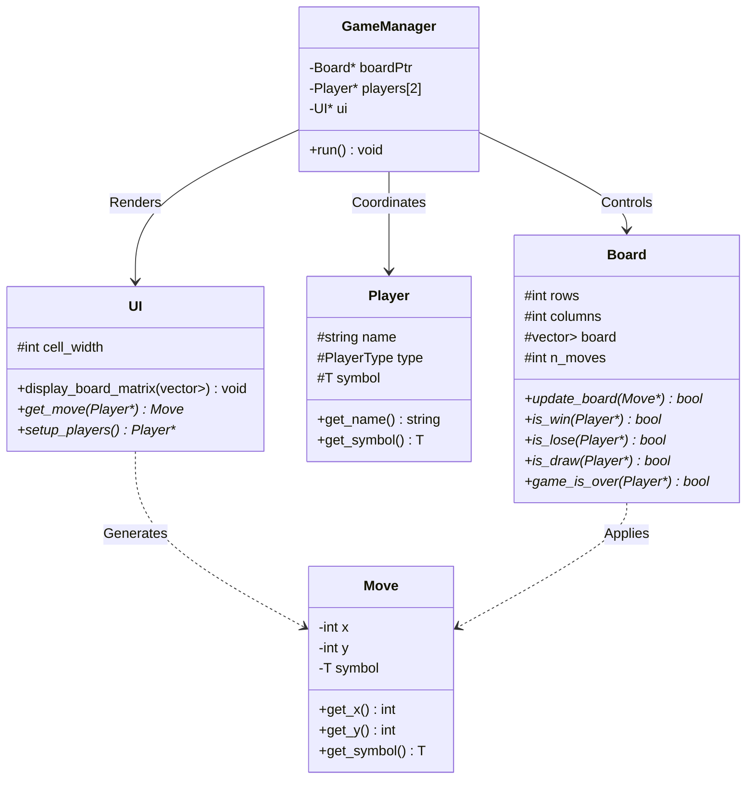

# 🎮 The Ultimate C++ Board Game Collection

Welcome to the **Ultimate Board Game Collection**, a high-performance, object-oriented C++ repository featuring **13 distinct, fully playable grid and Tic-Tac-Toe game variants**. 

Built upon a robust, highly extensible generic board-game engine, this suite ranges from classic strategy games like *Connect 4* and *Ultimate Tic-Tac-Toe* to completely unique, mathematically and logically innovative variants like *Diamond XO*, *Obstacle XO*, and *Memory XO*.

---

## 🏛️ Engine Architecture & Design System

The suite is engineered around a generic **Model-View-Controller (MVC) style** template system, ensuring deep separation of concerns between game rules (Model), console input/output rendering (View), and the overarching match coordination (Controller).

### Core Components
Every game in this collection is modularly constructed by subclassing five core class templates defined in [`Source/BoardGame_Classes.h`](file:///m:/GitHub%20Repos/BoardGames/Board-Games/Source/BoardGame_Classes.h):

1. **`Board<T>`**: Represents the game state grid. Holds grid dimensions, move history counts, and is responsible for verifying moves, wins, losses, draws, and general game-over criteria.
2. **`Player<T>`**: Holds player identifiers, symbol designations, and handles player roles (Human vs. Random Computer).
3. **`Move<T>`**: Packages the coordinate inputs and symbols for specific move updates.
4. **`UI<T>`**: Renders the state of the board in a clean, padded ASCII table and prompts players for move inputs.
5. **`GameManager<T>`**: Controls the main game loop, orchestrating turns, move validations, and termination logic until a result is achieved.

### 📊 Engine Collaboration Workflow



---

## 🕹️ The 13 Games Directory

Below is the directory of all supported game variants. Click on any game's name to view its **highly detailed rule-book, coordinate layout guides, and technical implementation blueprints**.

| ID | Game Name | Board Grid Size | Primary Mechanics | Core C++ Classes & Files | Rules & Guide |
| :--- | :--- | :---: | :--- | :--- | :---: |
| **01** | **Misere XO** | $3 \times 3$ | Classic Tic-Tac-Toe, but **getting 3-in-a-row loses** (inverse winning condition). | `MisereXO_Board`, `MisereXO_UI` | [📖 Read Guide](file:///m:/GitHub%20Repos/BoardGames/Board-Games/Documentation/Games/MisereXO.md) |
| **02** | **Numerical XO** | $3 \times 3$ | Numbers $1$-$9$ are shared. Odds vs. Evens. **Winner sums 3 cells to 15**. | `NumXO_Board`, `NumXO_Player`, `NumXO_UI` | [📖 Read Guide](file:///m:/GitHub%20Repos/BoardGames/Board-Games/Documentation/Games/NumXO.md) |
| **03** | **Sus XO (SOS)** | $3 \times 3$ | Drop `'s'` or `'u'`. High-score wins by **forming the sequence "s-u-s"**. | `SuS_TTT_Board`, `SuS_TTT_UI` | [📖 Read Guide](file:///m:/GitHub%20Repos/BoardGames/Board-Games/Documentation/Games/SusXO.md) |
| **04** | **4x4 Sliding XO** | $4 \times 4$ | $8$ pieces pre-placed. Slide pieces orthogonally. **First to align 3 wins**. | `Board4X4`, `UI4X4`, `Move4X4` | [📖 Read Guide](file:///m:/GitHub%20Repos/BoardGames/Board-Games/Documentation/Games/4x4XO.md) |
| **05** | **5x5 XO Score** | $5 \times 5$ | Board is filled over $24$ moves. **High-score wins by count of 3-in-a-rows**. | `_5X5_X_O_Board`, `_5X5_XO_UI` | [📖 Read Guide](file:///m:/GitHub%20Repos/BoardGames/Board-Games/Documentation/Games/5x5XO.md) |
| **06** | **Infinity XO** | $3 \times 3$ | Dynamic grid. **Every 3 moves, the oldest mark vanishes**. Quick wins! | `inf_X_O_Board`, `inf_XO_UI` | [📖 Read Guide](file:///m:/GitHub%20Repos/BoardGames/Board-Games/Documentation/Games/InfinityXO.md) |
| **07** | **Word XO** | $3 \times 3$ | Place letters $A$-$Z$. **Wins by forming any valid 3-letter English word** (uses `dic.txt`). | `word_X_O_Board`, `word_XO_UI` | [📖 Read Guide](file:///m:/GitHub%20Repos/BoardGames/Board-Games/Documentation/Games/WordXO.md) |
| **08** | **Connect 4** | $6 \times 7$ | Gravity column physics. **Align 4 consecutive tokens horizontally/vertically/diagonally**. | `connect_4_Board`, `connect_4_UI` | [📖 Read Guide](file:///m:/GitHub%20Repos/BoardGames/Board-Games/Documentation/Games/Connect4.md) |
| **09** | **Ultimate XO** | $9 \times 9$ | Macro-board. **Align three won 3x3 sub-grids in a row to win the overall match**. | `Ultimate_X_O_Board`, `Ultimate_X_O_UI` | [📖 Read Guide](file:///m:/GitHub%20Repos/BoardGames/Board-Games/Documentation/Games/UltimateXO.md) |
| **10** | **Diamond XO** | $7 \times 7$ (Diamond) | Active diamond layout. **Wins by forming intersecting length 3 and length 4 lines**. | `DiamondXO_Board`, `DiamondXO_UI` | [📖 Read Guide](file:///m:/GitHub%20Repos/BoardGames/Board-Games/Documentation/Games/DiamondXO.md) |
| **11** | **Obstacle XO** | $6 \times 6$ | Dynamic obstacles (`#`) placed every turn. **Align 4 consecutive marks to win**. | `ObstacleXO_Board`, `ObstacleXO_UI` | [📖 Read Guide](file:///m:/GitHub%20Repos/BoardGames/Board-Games/Documentation/Games/ObstacleXO.md) |
| **12** | **Memory XO** | $3 \times 3$ | Hidden marks. **Board hides all symbols as `#`**. Remember the grid to win! | `MemoryXO_Board`, `MemoryXO_UI` | [📖 Read Guide](file:///m:/GitHub%20Repos/BoardGames/Board-Games/Documentation/Games/MemoryXO.md) |
| **13** | **Pyramid XO** | Pyramid Shape | Tri-tier pyramid layout. **Align 3 marks horizontally/vertically/diagonally**. | `PyramidXO_Board`, `PyramidXO_UI` | [📖 Read Guide](file:///m:/GitHub%20Repos/BoardGames/Board-Games/Documentation/Games/PyramidXO.md) |

---

## 🚀 How to Compile and Run

This collection compiles into a single, unified interactive command-line application, allowing you to select and play any game on the fly.

### Prerequisites
Make sure you have a standard C++ compiler supporting **C++17 or higher** (e.g., `g++`, `clang++`, or Microsoft Visual C++ Compiler).

### Compilation
Open a terminal in the project's root folder (`Board-Games/`) and compile all source files together using `g++`:

```bash
g++ -std=c++17 Source/*.cpp -o board_games
```

### Running the Application
Run the compiled executable:

#### On Windows (PowerShell/CMD):
```powershell
./board_games.exe
```

#### On Linux/macOS:
```bash
./board_games
```

---

## 📁 Codebase Directory Structure

```text
Board-Games/
├── Documentation/             # Comprehensive Documentation & Doxygen Configs
│   ├── Doxyfile               # Doxygen API Document Configuration
│   └── Games/                 # Detailed Individual Game Documentation (Rules & Architecture)
│       ├── MisereXO.md
│       ├── NumXO.md
│       ├── SusXO.md
│       ├── 4x4XO.md
│       ├── 5x5XO.md
│       ├── InfinityXO.md
│       ├── WordXO.md
│       ├── Connect4.md
│       ├── UltimateXO.md
│       ├── DiamondXO.md
│       ├── ObstacleXO.md
│       ├── MemoryXO.md
│       └── PyramidXO.md
├── Source/                    # C++ Engine Core and Game-Specific Source Files
│   ├── BoardGame_Classes.h    # Framework Base Templates (Board, Player, Move, UI, GameManager)
│   ├── InputValidation.h      # Utility for safe user numeric coordinate inputs
│   ├── main.cpp               # Master central menu routing and executor entry-point
│   ├── dic.txt                # 3-letter English dictionary file for Word XO
│   └── *.[h/cpp]              # Individual game implementation classes
└── README.md                  # Beautiful Portal (This File)
```
